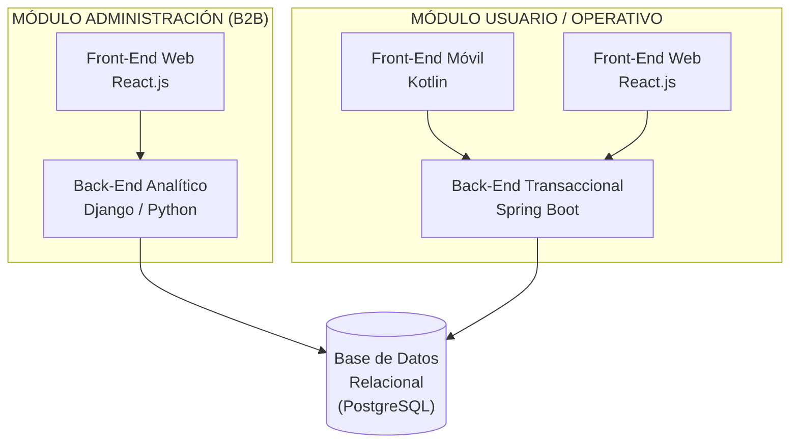
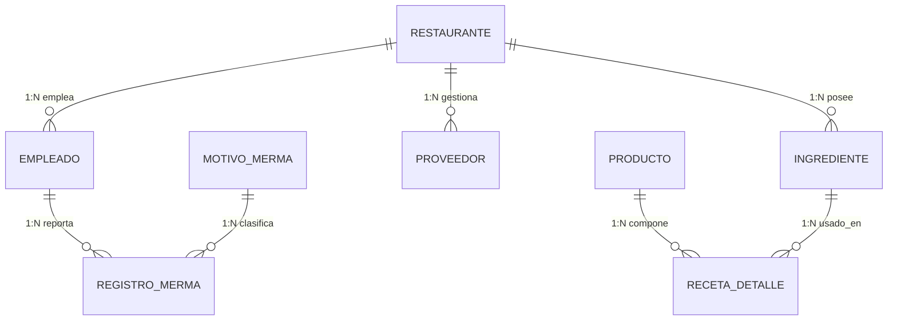

# GastroMind — Documento Técnico y de Proceso del Proyecto

**Curso:** Construcción y Pruebas de Software — Proyecto Integrador **Fecha de corte:** Semana 7 (miércoles 30/09/2026) **Equipo:** Diego Panez, Victor Santamaría, Piero Guevara

---

## 1. Visión del Proyecto

GastroMind **no es un sistema de ventas (POS)**. Es un software **B2B de optimización de costos, control estricto de mermas y gestión inteligente de almacén** para restaurantes.

**Problema que resuelve:** la brecha de inventario (*inventory variance*) causada por falta de control en insumos, errores de porcionado, accidentes de cocina no reportados y compras ineficientes.

**Diferenciador central:** descuento automático de insumos por receta (Kardex/BOM), con una capa adicional de control para insumos de bajo costo (condimentos) que no se pueden amarrar a una receta exacta, y auditoría de mermas con motor predictivo de IA.

---

## 2. Arquitectura del Sistema

El sistema se divide en **dos módulos independientes que comparten una sola base de datos relacional**:



**Por qué esta separación (y no un monolito):**

- El **módulo Administración** (Django + React) resuelve analítica, reportes y el motor de IA — cargas de trabajo que se benefician de Python (pandas/scikit-learn) y de un framework con admin panel out-of-the-box como Django.
- El **módulo Operativo** (Spring Boot + Kotlin/React) resuelve transacciones de alta frecuencia (tomar pedidos, registrar mermas, descontar stock) — Spring Boot da control fino sobre transacciones ACID, que es crítico porque un descuento de stock mal hecho rompe la confiabilidad de todo el sistema de mermas.
- **Ambos escriben a la misma base de datos**, nunca se duplican datos entre módulos — la fuente de verdad del Kardex es una sola tabla `ingrediente`, consultada por los dos backends.

---

## 3. Stack Tecnológico

| Capa | Tecnología | Por qué (no solo "qué") |
| --- | --- | --- |
| Backend transaccional | **Spring Boot** (Java) | Transacciones ACID robustas para operaciones de stock; tipado fuerte reduce errores de cálculo en descuentos de insumos. |
| Backend analítico | **Django** (Python) | Ecosistema maduro para reportes, dashboards y el motor de IA (pandas, scikit-learn); admin panel nativo acelera el desarrollo del lado Administración. |
| App móvil operativa | **Kotlin** (Android nativo) | Rendimiento y acceso nativo a notificaciones push (alertas de stock mínimo) para mozos, cocineros y almaceneros en planta. |
| Web Administración | **React.js** | SPA reactiva para dashboards con actualización en tiempo real (gráficos de merma, KPIs). |
| Web Operativo (alternativa a Kotlin) | **React.js** | Mismo framework que el panel de Admin, permite reutilizar componentes si un restaurante prefiere operar desde una tablet/PC en vez de celular. |
| Base de datos | **PostgreSQL** | Soporta `CHECK` constraints, triggers (necesarios para la integridad multi-tenant) y JSONB si se requiere flexibilidad futura. |
| Autenticación | **JWT** | Stateless, mismo token sirve para validar rol tanto en Spring Boot como en Django sin sesión compartida. |

---

## 4. Equipo y Roles Scrum

| Integrante | Rol Scrum | Responsabilidad técnica principal |
| --- | --- | --- |
| **Jaime Gómez** (docente) | **Product Owner** (real) | Dueño de la visión, acepta o rechaza el incremento en cada Sprint Review. |
| **Victor Santamaría** | **Scrum Master** | Facilita rituales (daily, planning, review, retro), destraba impedimentos del equipo. |
| **Diego Panez** | **PO Delegado** (no oficial de Scrum) | Mantiene el backlog priorizado día a día, prepara la demo para el profesor. Representa al PO real entre una revisión y otra — **no decide alcance por su cuenta**. |
| Los 3 (Diego, Victor, Piero) | **Equipo de Desarrollo** | Programan las historias de usuario comprometidas en cada sprint, sin importar su otro rol. |

> **Nota de rigor:** en Scrum/SBOK solo existen 3 roles oficiales (Product Owner, Scrum Master, Equipo de Desarrollo). "PO Delegado" es un acuerdo práctico del equipo, no un rol formal — se documenta así para ser honestos frente a la rúbrica de "Identificando los procesos de SCRUM".

---

## 5. Modelo de Datos

Base de datos relacional única, compartida por ambos módulos, diseñada bajo el patrón **BOM/Kardex** con dos refuerzos de rigor:

1. **Multi-tenant real:** `ingrediente` y `proveedor` llevan `restaurante_id` — necesario porque GastroMind es B2B y debe servir a varios restaurantes sin mezclar su stock. Un trigger en `receta_detalle` impide vincular un producto de un restaurante con un insumo de otro.
2. **Clasificación ABC de insumos** (`tipo_control`: `RECETA` vs `LIBRE`): resuelve el caso de condimentos de consumo libre (mayonesa, sal) con una **dotación periódica** (cantidad asignada por semana/mes) auditada por conteo cíclico, en vez de exigir que el mozo anote cada extra que entrega.



*(Diagrama completo con los 13 entidades y el script SQL ya generados por separado — `gastromind_er.mmd` y `gastromind_base_datos.sql`.)*

---

## 6. Proceso Scrum Aplicado

### 6.1 Épicas y Backlog Priorizado

**Son 6 épicas en total — ya no deberían aparecer más.** Se derivan directamente de los módulos funcionales de la visión original del proyecto (RF01 a RF20 ya definidos): cada requisito funcional cae dentro de una de estas 6, sin que quede ninguno fuera. Si en algún sprint surge una necesidad nueva, lo correcto es ubicarla como una HU adicional dentro de una épica existente, no crear una séptima.

| Nro. | Épica | Prioridad | RF que cubre |
| --- | --- | --- | --- |
| 1 | Acceso y Seguridad | Alta | RF01-RF04 |
| 2 | Insumos y Recetas | Alta | RF05-RF08, RF20 |
| 3 | Toma de Pedidos y Comanda | Alta | RF12-RF14 |
| 4 | Inventario Automático | Media | RF15-RF19 |
| 5 | Control de Mermas | Media | RF08-RF09, RF11 (parte) |
| 6 | Inteligencia de Compras y Reportes | Baja | RF10-RF11 (parte) |

### 6.2 Calendario Real del Proyecto (según cronograma del docente) — 4 sprints, el 4to es la entrega final

| Semana(s) | Hito | Épica(s) trabajadas |
| --- | --- | --- |
| 5-6 | Pre-Sprint: Visión, Épicas, Backlog Priorizado, Criterio de Terminado | ✅ **completado** |
| **7-8** | **Sprint 1** (en curso) | EP-01 Acceso y Seguridad |
| 9-10 | Sprint 2 | EP-02 Insumos y Recetas |
| 11-12 | Sprint 3 | EP-03 Toma de Pedidos y Comanda **+** EP-04 Inventario Automático |
| 13-14 | Sprint 4 — **Entrega final** | EP-05 Control de Mermas **+** EP-06 Inteligencia de Compras y Reportes |

> ⚠️ **Punto estricto a tener en cuenta:** con solo 4 sprints para 6 épicas, los Sprints 3 y 4 cargan dos épicas cada uno. Es ambicioso. La recomendación es, dentro de esos sprints, priorizar las HU que dan valor mínimo viable (ej. en EP-06 quedarse con el dashboard y dejar la sugerencia de compra por IA como "si alcanza el tiempo") en vez de intentar las 4 HU completas de cada épica.

### 6.3 Sprint 1 — Comprometido (Épica: Acceso y Seguridad)

**Planning Poker (estimación de esfuerzo, escala 0.5 / 1 / 2 / 3 / 5 / 8):**

| HU | Piero Guevara | Diego Panez | Victor Santamaría | Esfuerzo (consenso) |
| --- | --- | --- | --- | --- |
| HU-01 Registrar empleados | 6 | 5 | 3 | **5** |
| HU-02 Iniciar sesión | 5 | 5 | 4 | **5** |
| HU-03 Activar/desactivar usuarios | 3 | 4 | 3 | **3** |
| HU-04 Recuperar contraseña *(no comprometida este sprint)* | 4 | 4 | 3 | 4 |

**Desglose de tareas y horas (hecho en clase, 3 estimaciones por tarea → se toma la mediana del equipo):**

*HU-01 — Registrar empleados (responsable: Piero Guevara) — 9h*

| Tarea | Piero | Diego | Victor | Horas (equipo) |
| --- | --- | --- | --- | --- |
| Diseñar el modelo de datos de Usuario y Rol | 1 | 2 | 3 | 2 |
| Crear el formulario de registro de empleados | 2 | 1 | 3 | 2 |
| Implementar el backend para guardar al empleado con su rol | 2 | 3 | 4 | 3 |
| Validar que no se registren correos duplicados | 1 | 2 | 3 | 2 |

*HU-02 — Iniciar sesión (responsable: Diego Panez) — 9h*

| Tarea | Piero | Diego | Victor | Horas (equipo) |
| --- | --- | --- | --- | --- |
| Crear el formulario web de login | 3 | 4 | 3 | 3 |
| Implementar el backend para validar las credenciales | 1 | 2 | 1 | 1 |
| Validar que la base de datos no acepte scripts maliciosos (SQL injection) | 3 | 3 | 3 | 3 |
| Crear el enlace que valida las credenciales y da acceso | 2 | 2 | 2 | 2 |

*HU-03 — Activar/desactivar usuarios (responsable: Victor Santamaría) — 9h*

| Tarea | Piero | Diego | Victor | Horas (equipo) |
| --- | --- | --- | --- | --- |
| Agregar el campo estado (activo/inactivo) al modelo | 3 | 2 | 2 | 2 |
| Crear la vista de listado con opción de activar/desactivar | 4 | 3 | 2 | 3 |
| Implementar la lógica que bloquea el acceso a inactivos | 2 | 3 | 1 | 2 |
| Registrar el historial de cambios de estado | 1 | 4 | 2 | 2 |

**Total comprometido: 27h de 30h de capacidad** (3 integrantes × 10h). Buffer real: **3h** (antes se había estimado 24h/6h de forma preliminar — este número reemplaza esa estimación con el dato real de la sesión de Planning Poker en clase).

> **Adelanto para el Sprint 2:** el equipo ya corrió Planning Poker también sobre HU-05 (Registrar insumos, esfuerzo 4, 9h de tareas) y HU-06 (Registrar receta, esfuerzo 3, 10h de tareas) de la épica EP-02 Insumos y Recetas. Ese trabajo queda listo para no perder tiempo re-estimando cuando arranque el Sprint 2 en la semana 9.

**Criterio de Terminado (DoD):** código mergeado sin romper CI, criterios de aceptación cumplidos, revisión por un compañero, pruebas automatizadas en verde, sin vulnerabilidades conocidas, aceptado por el Product Owner en Sprint Review.

### 6.4 ¿Por qué el repositorio y la base de datos NO son una épica ni una HU?

Una historia de usuario tiene que cumplir el criterio **INVEST** — en particular ser **Valiosa**: algo que un rol del negocio (gerente, mozo, cocinero, almacenero) pueda usar y aceptar como funcionando. "Crear un repositorio en GitHub" o "crear la base de datos" no es algo que un gerente pueda "aceptar" como funcionalidad — es trabajo de soporte que habilita que las HU reales se puedan construir. Por eso quedan como **tareas técnicas dentro de la primera HU que las necesita**, tal como ya quedó en el Sprint Backlog (tareas 1 y 2 de HU-02).

**Quién se encarga de cada etapa** (dentro del equipo de 3):

| Etapa | Responsable | Detalle |
| --- | --- | --- |
| **Planificar** (elegir estructura del repo, motor de BD, diseño del ER) | Equipo completo | Decisión ya tomada en conjunto — el monorepo y el script SQL que ya tienen. |
| **Ejecutar** (crear el repo, correr el script SQL) | Diego Panez | Es trabajo previo a las tareas oficiales de HU-02 (por eso no aparece como línea del Planning Poker de la sección 6.3 — ese desglose solo mide las tareas de construcción de la funcionalidad, no la infraestructura inicial). |
| **Validar / aprobar** | Victor Santamaría | Como Scrum Master, revisa el Pull Request antes de mergear — es parte del DoD ("revisado por al menos un compañero") y de su función de asegurar que el equipo tenga lo que necesita para trabajar. |

**Nota de rigor:** el repo y la BD no cuentan dentro de las 9h estimadas de HU-02 en el Planning Poker (sección 6.3) — ese ejercicio de estimación, hecho en clase con el equipo completo, midió exclusivamente las tareas de construcción de la funcionalidad (formulario, backend, validaciones). El setup de repo/BD fue trabajo previo de Diego, ya resuelto antes de que arrancara el conteo oficial del sprint.

---

## 7. Organización del Repositorio (Monorepo)

```
GastroMind/
├── backend-spring/     (Spring Boot — módulo operativo)
├── backend-django/     (Django — módulo administración/IA)
├── app-kotlin/          (App móvil operativa)
├── web-react/           (Web Admin + alternativa web operativa)
├── docs/                (ER, backlog, planes de sprint, plan de pruebas)
└── .github/workflows/   (CI por componente, disparado solo si cambia esa carpeta)
```

Rama `main` protegida, todo cambio entra por Pull Request con al menos una aprobación. Convención de ramas por historia: `feature/HU-02-login`.

---

## 8. Estado Actual del Proyecto (Semana 7)

✅ **Completado:** visión y aspectos del proyecto (organización, justificación de negocio, calidad, riesgo, cambio), 6 épicas definidas, backlog priorizado, criterios de terminado, modelo de datos (ER + SQL), estructura de repositorio.

🔄 **En curso:** Sprint 1 — 3 historias de usuario de la épica "Acceso y Seguridad" repartidas una por integrante.

⏳ **Pendiente:** Sprints 2 a 4 (insumos/recetas, pedidos, mermas, inteligencia de compras).

---

## 9. Puntos para validar con el profesor

1. ~~Confirmar que el proyecto corre en 4 sprints~~ — ✅ **ya confirmado**: 4 sprints, el 4to es la entrega final.
2. Validar el enfoque **multi-tenant** (varios restaurantes en una sola base de datos) — ¿es el alcance esperado para el curso, o basta con un solo restaurante?
3. Validar la solución de **dotación periódica** para condimentos (mayonesa, sal) como respuesta a su observación original sobre los extras difíciles de controlar.
4. Opinión sobre usar el término **"PO Delegado"** (no oficial) vs. un nombre más alineado al SBOK, como **Scrum Guidance Body**.
5. Confirmar si el rol de **Scrum Master** se mantiene fijo en Victor todo el proyecto, o rota por sprint entre los 3.
6. **Validar el riesgo de los Sprints 3 y 4**: al cargar 2 épicas por sprint, ¿el profesor prefiere que recorten alcance dentro de cada épica (MVP) o que prioricen completar menos épicas pero más a fondo?