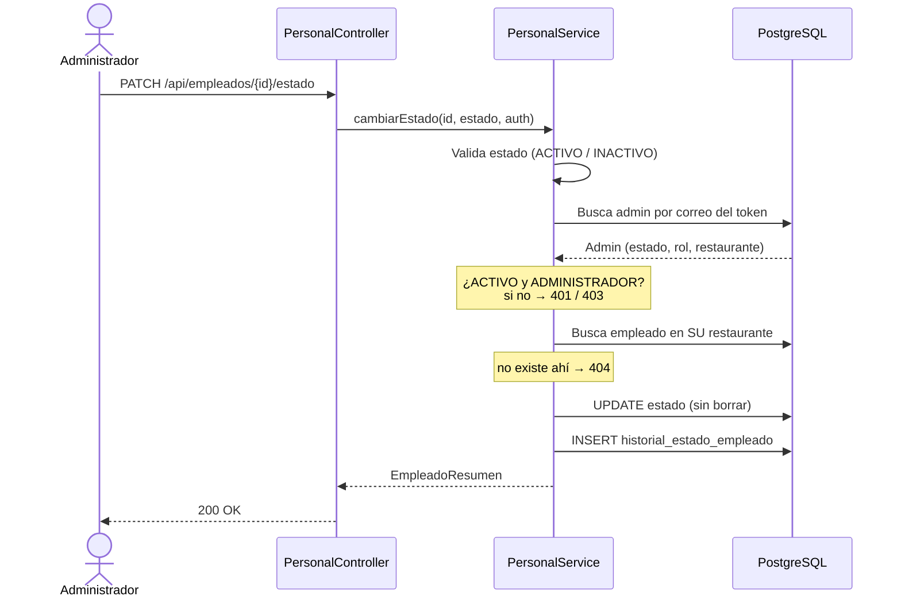
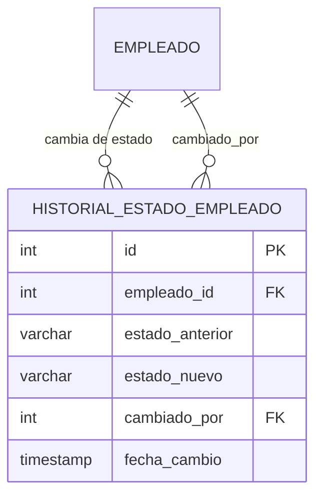

<div align="center">

# 👥 HU-03 · Activar y desactivar empleados

**GastroMind** — Sprint 1 · Épica EP-01 *Acceso y seguridad*


</div>

> *"Yo como gerente debo poder activar o desactivar usuarios para retirar el acceso al personal que ya no labora."*

| | |
|---|---|
| **Responsable** | Victor Santamaría |
| **Sprint** | 1 · semanas 7-8 |
| **Rama** | `feature/HU-03-estado-empleados` (desde `feature/HU-02-login`) |
| **Estimación** | 9 h (Sprint Backlog) |
| **Actualizado** | 05/10/2026 |

---

## 🎯 Criterio de aceptación

**CA-03** — Un usuario desactivado no puede iniciar sesión y el sistema le informa que su cuenta está inactiva.

Reglas que cumple la implementación:

- 🔐 Solo un **ADMINISTRADOR activo** puede listar y cambiar estados.
- 🏢 Cada admin solo ve y modifica empleados de **su restaurante**: el `restaurante_id` sale del usuario autenticado, nunca del cliente.
- 🔄 Estados válidos: `ACTIVO` e `INACTIVO`.
- 🗃️ **Borrado lógico**: el empleado nunca se elimina, porque pedidos, mermas e ingresos lo referencian.
- 🙈 Las respuestas nunca exponen `password_hash` ni `pin_acceso`.
- 📝 Cada cambio queda registrado en un **historial** (quién, cuándo, de qué estado a cuál).

## ✅ Tareas del Sprint Backlog

| # | Tarea | h | Estado |
|---|---|:-:|---|
| 1 | Agregar el campo estado (activo/inactivo) al modelo de usuario | 2 | ✅ `Empleado.estado` + enum `EstadoEmpleado` |
| 2 | Crear la vista de listado con opción de activar/desactivar | 3 | 🟡 API lista · vista según el cliente que elija el equipo |
| 3 | Implementar la lógica para bloquear el acceso de usuarios inactivos | 2 | ✅ Login (HU-02) + revalidación en cada petición de HU-03 |
| 4 | Registrar el historial de cambios de estado de cada usuario | 2 | ✅ Tabla `historial_estado_empleado` |

## 🔀 Flujo de un cambio de estado



## 🌐 Endpoints

| Método | Ruta | Permiso | Descripción |
|---|---|---|---|
| `GET` | `/api/empleados` | ADMINISTRADOR | Lista el personal del restaurante del admin |
| `PATCH` | `/api/empleados/{id}/estado` | ADMINISTRADOR | Cambia el estado y registra el historial |

<details>
<summary><b>Ejemplo de petición y respuesta</b></summary>

```http
PATCH /api/empleados/2/estado
Authorization: Bearer <token>
Content-Type: application/json

{ "estado": "INACTIVO" }
```

```json
{
  "id": 2,
  "nombreCompleto": "Mozo Uno",
  "correo": "mozo@resto1.com",
  "rol": "MOZO",
  "estado": "INACTIVO"
}
```

</details>

| Código | Cuándo |
|:-:|---|
| `200` | Cambio realizado. Si ya tenía ese estado, responde igual y no duplica el historial |
| `400` | Estado vacío o distinto de `ACTIVO` / `INACTIVO` |
| `401` | Sin autenticación, o el admin está inactivo |
| `403` | El usuario no es ADMINISTRADOR |
| `404` | El empleado no existe **en su restaurante** (no revela si existe en otro) |

## 🗂️ Estructura

Paquete `com.gastromind.backendspring`. **Solo se agregaron archivos nuevos**: el código de HU-02 no se modificó.

```text
backend-spring/src/main/java/com/gastromind/backendspring/
├── controller/  PersonalController.java
├── dto/         CambioEstadoRequest.java · EmpleadoResumen.java
├── entity/      EstadoEmpleado.java · HistorialEstadoEmpleado.java
├── repository/  PersonalRepository.java · HistorialEstadoEmpleadoRepository.java
└── service/     PersonalService.java

backend-spring/src/test/java/.../service/PersonalServiceTest.java
docs/HU-03/      README.md · historial_estado_empleado.sql
```

**Decisiones de diseño**

- Reutiliza las entidades compartidas `Empleado`, `Rol` y `Restaurante` de HU-02 tal como están.
- `PersonalRepository` es independiente de `EmpleadoRepository`: cada HU mantiene sus consultas sin pisarse.
- Arquitectura en capas: `Controller → Service → Repository → PostgreSQL`.

## 🛢️ Base de datos

Nueva tabla, en [`historial_estado_empleado.sql`](./historial_estado_empleado.sql). Se ejecuta después de `docs/script_database.sql`:



El script también agrega el índice `idx_empleado_restaurante`, porque el listado filtra por `restaurante_id`.

## 🧪 Pruebas

```bash
cd backend-spring
./mvnw test
```

`PersonalServiceTest` (JUnit 5 + Mockito, sin base de datos):

| Caso | Esperado |
|---|---|
| Admin lista personal | Solo su restaurante |
| Admin desactiva empleado | Estado cambia, no se borra, se registra historial |
| Mismo estado | No se duplica el historial |
| Empleado de otro restaurante | `404` |
| Estado inválido | `400` |
| Usuario sin rol admin | `403` |
| Admin inactivo / sin autenticación | `401` |

**Resultado (05/10/2026):** 14 pruebas, 0 fallos (8 de HU-03 + 6 de HU-02).

## 🤝 Integración con el equipo

| Con | Punto de integración |
|---|---|
| **HU-02** · Inicio de sesión | El nombre del usuario autenticado es su **correo** (el `subject` del JWT). Los endpoints de HU-03 responden cuando la petición llega autenticada por el filtro JWT. |
| **HU-02** · Revocación | Para que un desactivado pierda acceso a *todos* los endpoints con un token anterior, el filtro JWT debe consultar el estado en cada petición. HU-03 ya lo hace en los suyos. |
| **HU-01** · Registro | El `POST /api/empleados` puede ir en otro controlador sobre la misma ruta, sin repetir los mapeos `GET` y `PATCH`. |

## 📌 Pendiente

- [ ] Vista con el switch de estado, cuando el equipo defina el cliente (React o Kotlin).
- [ ] Decidir con el PO si un admin puede desactivarse a sí mismo.
- [ ] Decidir si se puede desactivar al último admin activo del restaurante.
- [ ] Acordar quién aplica los scripts del esquema compartido.
- [ ] Pull Request y revisión cruzada.

---

<div align="center">
<sub>GastroMind · Proyecto integrador · Construcción y Pruebas de Software · Tecsup 2026</sub>
</div>
